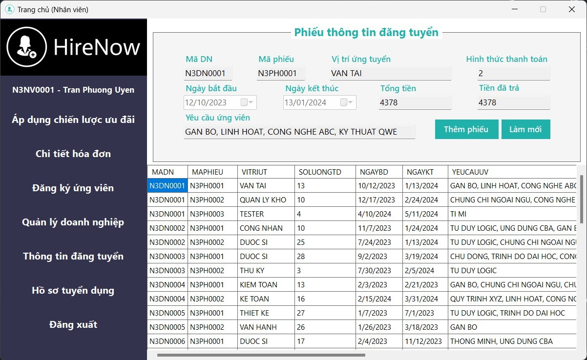

<a name="readme-top"></a>

# ISAD - QLTuyenDung and IS Analysis & Design

-   Group project from HCMUS's 2024 Information Systems Analysis & Design course.

<div align="center">
  
  
</div>
<div align="center">
  
  
</div>

<details open>
  <summary>Table of Contents</summary>
  <ul>
    <li>
      <a href="#content">Content</a>
    </li>
    <li>
      <a href="#getting-started">Getting Started</a>
      <ul>
        <li><a href="#prerequisites">Prerequisites</a></li>
        <li><a href="#installation">Installation</a></li>
      </ul>
    </li>
    <li>
      <a href="#usage">Usage</a>
      <ul>
        <li><a href="#to-set-up-the-database">To set up the database</a></li>
        <li><a href="#to-uninstall-the-database">To uninstall the database</a></li>
        <li><a href="#to-link-oracle-with-winforms">To link Oracle with WinForms</a></li>
        <li><a href="#to-link-excel-with-winforms">To link Excel with WinForms</a></li>
      </ul>
    </li>
    <li><a href="#built-with">Built With</a></li>
    <li><a href="#meet-the-team">Meet The Team</a></li>
  </ul>
</details>

## Content

-   `DataGenerators` for generating silly data, duh, go read its [`README.md`](DataGenerators/README.md).

-   [`DATH_PTTKHTTT_HK2_2324.pdf`](DATH_PTTKHTTT_HK2_2324.pdf) describes all the tasks and requirements of the project.

-   `Diagrams.eapx` contains all diagrams that are in `Report.pdf`, opened with `Enterprise Architect`.

-   [`Report.pdf`](Report.pdf) is our FULL documentation for all the designs and required tasks.

### `ISAD_QLTuyenDung`, `QLTD_Release`

Source code, release build, and resources pertaining to the C# WinForms app.

Before trying to run the solution in `ISAD_QLTuyenDung`, **make sure to modify [`Others/OracleConfig.cs`](ISAD_QLTuyenDung/ISAD_QLTuyenDung/HoTro/OracleConfig.cs) to fit YOUR environment**.

### `SQL`

Note that we use Oracle 21c Express, the default CDB and PDB created during installation, i.e., `XE` and `XEPDB1`, with the configuration as follows,

-   **Database host name:** localhost,
-   **Port number:** 1521,
-   **Service name:** XEPDB1.

Therefore, a full connection to PDB, let's say as `SYS`, will have the format,

```sql
CONN SYS/password@LOCALHOST:1521/XEPDB1 AS SYSDBA;
```

Furthermore, the database is hosted on schema/user `PTTK03_QLTUYENDUNG`. All users share the same password of `123`, and their username (i.e., ID) can be found in `data.sql`.

## Getting Started

### Prerequisites

-   Windows 10 or 11.
-   [Oracle Database 21c Express Edition](https://www.oracle.com/database/technologies/xe-downloads.html) and
    [SQL Developer 23.1.1](https://www.oracle.com/database/sqldeveloper/technologies/download/).
-   **_For WinForms development:_**

    -   [Visual Studio 2022](https://visualstudio.microsoft.com/vs/) and its `.NET desktop development` workload.

-   **_For drawing diagrams:_** [Sparx Systems Enterprise Architect](https://sparxsystems.com/products/ea/).

-   _(Optional)_ Any decent code editor, preferably [VSCode](https://code.visualstudio.com/).
    -   It just makes editing the database's source code easier.

### Installation

-   Clone the repo.

## Usage

### To set up the database

1. Well, good luck setting up `Oracle Database 21c Express Edition`.
1. [Have a `PDB` and enable `OLS`](#to-enable-ols).
1. Navigate into `SQL` folder.
1. If a different `PDB` is used, replace all instances of `XEPDB1`.
1. `SYS.XEPDB1` Run the files in the specified order, `createDB.sql` &rarr; `data.sql` &rarr; `procs.sql` &rarr; `users_privs.sql`.

### To uninstall the database

1. Run `cleanupDB.sql`.
    - Should take care to close all connections beforehand so everything can be dropped smoothly, no `ORA-01940: cannot DROP a user that is currently logged in`.

<p align="right">(<a href="#readme-top">back to top</a>)</p>

### To link Oracle with WinForms

1. Open `ISS_QLTuyenDung.sln` with Visual Studio 2022.
1. Modify `Others/OracleConfig.cs` to fit your environment.
1. On the taskbar, select `Project` &rarr; `Manage NuGet Packages...`.
1. Move to `Browse` tab, search for `oracle`, and install `Oracle.ManagedDataAccess.Core`.
1. Try to run the program, if it still fails, proceed to step the next step.
1. Locate the path to `Oracle.DataAccess.dll` with Windows File Explorer.
    - Mine was `...\Oracle21c\dbhomeXE\ODP.NET\bin\4`.
1. Back to VS2022, in the `Solution Explorer`, right-click `ISS_QLTuyenDung`.
    - It's right beneath `Solution 'ISS_QLTuyenDung' (1 of 1 project)`.
1. Select `Add` &rarr; `Project Reference...`.
1. Move to `Browse` tab, then click `Browse...` at bottom right of the window.
1. Navigate to the path at step 6.
1. Select `Oracle.DataAccess.dll` then `Add`.
    - Try to run the app, if it still fails, o7 then since I got mine to work at this point.

<p align="right">(<a href="#readme-top">back to top</a>)</p>

### To link Excel with WinForms

1. Open `ISS_QLTuyenDung.sln` with Visual Studio 2022.
1. Modify `Others/OracleConfig.cs` to fit your environment.
1. On the taskbar, select `Project` &rarr; `Manage NuGet Packages...`.
1. Move to `Browse` tab, search for `interop.excel`, and install `Microsoft.Office.Interop.Excel`.
1. Try to perform any Export to Excel feature, proceed to the next step if encounter below error.
    ```csharp
    Could not load file or assembly 'office, Version=15.0.0.0, Culture=neutral, PublicKeyToken=71e9bc111e9429c' or one of its dependencies. The system cannot find the file specified.
    ```
1. Uninstall the package at step 4.
1. Locate the path to `Microsoft.Office.Interop.Excel.dll` with Windows File Explorer.
    - It should be somewhere in the Microsoft Office folder.
    - Mine was `C:\Program Files\Microsoft Office\root\vfs\ProgramFilesX86\Microsoft Office\Office16\DCF`.
1. Back to VS2022, in the `Solution Explorer`, right-click `ISS_QLTuyenDung`.
    - It's right beneath `Solution 'ISS_QLTuyenDung' (1 of 1 project)`.
1. Select `Add` &rarr; `Project Reference...`.
1. Move to `Browse` tab, then click `Browse...` at bottom right of the window.
1. Navigate to the path at step 7.
1. Select `Microsoft.Office.Interop.Excel.dll` then `Add`.
    - Try to run the app, if it still fails, o7 then since I got mine to work at this point.

## Built With

[vsicon]: https://skillicons.dev/icons?i=visualstudio&theme=dark
[vsurl]: https://visualstudio.microsoft.com/vs/
[dotneticon]: https://skillicons.dev/icons?i=dotnet
[dotneturl]: https://dotnet.microsoft.com/en-us/download/dotnet/8.0
[oracleicon]: https://cdn.jsdelivr.net/gh/devicons/devicon@latest/icons/oracle/oracle-original.svg
[oracleurl]: https://www.oracle.com/database/technologies/xe-downloads.html
[sqldevicon]: https://cdn.jsdelivr.net/gh/devicons/devicon@latest/icons/sqldeveloper/sqldeveloper-original.svg
[sqldevurl]: https://www.oracle.com/database/sqldeveloper/technologies/download/
[EAicon]: https://sparxsystems.com/images/earose.png
[EAurl]: https://sparxsystems.com/products/ea/
[vscodeicon]: https://skillicons.dev/icons?i=vscode&theme=dark
[vscodeurl]: https://code.visualstudio.com/
[windowsicon]: https://cdn.jsdelivr.net/gh/devicons/devicon/icons/windows8/windows8-original.svg
[windowsurl]: https://www.microsoft.com/en-us/windows/

| [![VisualStudio2022][vsicon]][vsurl] | [![.NET8.0][dotneticon]][dotneturl] | [![Oracle 21c Express][oracleicon]][oracleurl] | [![SQL Developer][sqldevicon]][sqldevurl] | [![EnterpriseArchitect][EAicon]][EAurl] | [![VSCode][vscodeicon]][vscodeurl] | [![Windows][windowsicon]][windowsurl] |
| :----------------------------------: | :---------------------------------: | :--------------------------------------------: | :---------------------------------------: | :-------------------------------------: | :--------------------------------: | :-----------------------------------: |
|             2022 v17.9.4             |                 8.0                 |              21c Express Edition               |                23.1.1.345                 |                15.2.1554                |               1.87.2               |     &nbsp;&nbsp; 11 &nbsp;&nbsp;      |

## Meet The Team

<div align="center">
  <a href="https://github.com/phongan1x5"></a>&nbsp;&nbsp;&nbsp;
  <a href="https://github.com/kru01"></a>&nbsp;&nbsp;&nbsp;
  <a href="https://github.com/faithdanghuy"></a>&nbsp;&nbsp;&nbsp;
  <a href="https://github.com/Namiscrea7or"></a>&nbsp;&nbsp;&nbsp;
</div>

<p align="right">(<a href="#readme-top">back to top</a>)</p>
